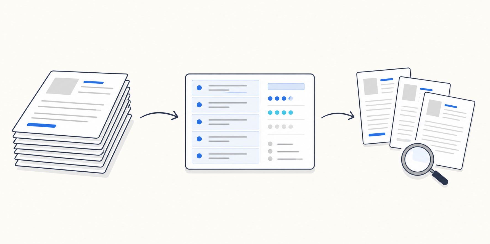

# PaperMason

[English](README.md) | [简体中文](README.zh-CN.md)



> **A Codex Skill and plugin for building, searching, and maintaining a local,
> catalog-first paper library.**

PaperMason gives Codex a disciplined way to use a personal literature library:
invoke `$papermason`, search `library.jsonl`, select a few candidate papers,
then read the relevant Markdown, PDF, or figure as evidence. It is designed to
prevent a common failure mode—an agent blindly scanning a large folder and
confusing a filename, title, or catalog field for a supported claim.

The core is a reusable Codex Skill packaged as a Codex plugin. Its optional
Python CLI makes catalog creation, ingestion, and verification deterministic;
the Skill itself works read-only with an existing `library.jsonl` and does not
need Python, MinerU, a cloud service, an API key, or a GPU.

## Use it in Codex

After installation, give Codex a concrete retrieval task such as:

> Use `$papermason` to find 4 papers in my local library about diffusion-based
> trajectory prediction. Return candidate paths and versions first, then read
> only the most relevant Introduction and method sections. Do not modify files.

PaperMason turns this into an evidence-led sequence:

```text
research question -> catalog search -> small candidate set -> source inspection -> evidence-backed answer
```

The catalog routes the agent to sources; it never replaces the sources as
evidence.

## Install in Codex

### Recommended: install the plugin from GitHub

If your Codex environment supports GitHub marketplaces, run:

```bash
codex plugin marketplace add QKB-HEU/PaperMason --ref main
codex plugin add papermason@papermason
```

Then start a new Codex task and invoke `$papermason`. The plugin includes the
Skill only, so this installation has no Python, converter, or API-key
requirement.

You can also ask Codex directly:

> Install the Codex plugin from https://github.com/QKB-HEU/PaperMason

### Fallback: install only the Skill

If your Codex environment cannot install a community plugin yet, ask it to:

> Install the Codex Skill from GitHub repo `QKB-HEU/PaperMason`, path
> `plugins/papermason/skills/papermason`.

When working from a clone, Codex also discovers the repository-scoped Skill at
`.agents/skills/papermason` automatically. The direct Skill route supports
catalog-first retrieval; install the optional CLI only when you also need to
create, bootstrap, verify, or ingest a library.

## Optional: install the CLI

The CLI needs Python 3.11+ and [uv](https://docs.astral.sh/uv/). If
`uv --version` is unavailable, install uv with its
[official instructions](https://docs.astral.sh/uv/getting-started/installation/),
then run:

```bash
uv tool install "git+https://github.com/QKB-HEU/PaperMason.git"
papermason --help
```

For a source checkout:

```bash
git clone https://github.com/QKB-HEU/PaperMason.git
cd PaperMason
uv tool install .
papermason --help
```

Use the CLI independently or let Codex call it through `$papermason` when it
is available. MinerU is used when PaperMason converts new PDFs.

## What problem it solves

A directory of PDFs and converted Markdown is readable to a person but opaque
to an AI: it does not know which files are relevant, whether an item is a
preprint, or where a figure belongs. PaperMason keeps a `library.jsonl` catalog
with one record per paper version. The correct retrieval pattern is:

```text
question -> catalog search -> select a small evidence set -> read those sources
```

The catalog is a routing layer, **not evidence**. An agent must still inspect
the chosen Markdown or PDF before it makes a factual claim.

## Features

- Local-first: PDF text and conversion artifacts stay on your computer.
- Converter-optional: searching, verifying, and cataloging existing Markdown
  require only Python's standard library. MinerU is an optional PDF converter,
  not a PaperMason dependency.
- Safe ingestion: checks exact PDF hashes, DOI, and arXiv identifiers before a
  conversion; external PDFs are copied by default rather than moved.
- Existing-library bootstrap: indexes your current Markdown and optionally
  links PDFs without renaming, moving, or rewriting either.
- Agent-friendly retrieval: stable, concise `search` output lets an agent open
  only the relevant source files.
- Portable layout: new libraries have neutral directory names; the older
  `INBOX/PDF/Markdown` layout is detected for backward compatibility.

## Start a new library

Choose a location outside the PaperMason source checkout:

```bash
papermason --library ~/Research/Papers init
```

This creates an empty, portable library:

```text
Papers/
├── inbox/          # optional landing place for PDFs
├── papers/         # PaperMason-managed PDF copies
├── markdown/       # one readable Markdown file per paper
├── assets/         # converter artifacts and local figures
└── library.jsonl   # one JSON record per paper version
```

No source PDF, Markdown, or image is uploaded anywhere.

## Choose your starting point

### I already have Markdown or a converter output folder

First preview the catalog that would be built:

```bash
papermason --library ~/Research/Papers bootstrap \
  --markdown-dir ~/OldLibrary/markdown \
  --pdf-dir ~/OldLibrary/pdfs \
  --dry-run
```

If the record count and PDF links look right, run the same command without
`--dry-run`:

```bash
papermason --library ~/Research/Papers bootstrap \
  --markdown-dir ~/OldLibrary/markdown \
  --pdf-dir ~/OldLibrary/pdfs
```

Repeat `--markdown-dir` or `--pdf-dir` to join multiple collections. The
source folders stay where they are; PaperMason writes only `library.jsonl` and
its empty library layout. Files it cannot match are marked for review instead
of guessed.

### I have PDFs and want PaperMason to convert them

Install and test a local PDF-to-Markdown converter first. PaperMason supports
MinerU out of the box, but keeps it optional:

```bash
papermason --library ~/Research/Papers ingest ~/Downloads/paper.pdf \
  --mineru /absolute/path/to/mineru \
  --label concise-paper-label \
  --dry-run
```

Review the proposed title, year, venue, filename, and duplicate status. Remove
`--dry-run` only when they are acceptable:

```bash
papermason --library ~/Research/Papers ingest ~/Downloads/paper.pdf \
  --mineru /absolute/path/to/mineru \
  --label concise-paper-label
```

An external PDF is copied into `papers/`; the original remains in Downloads.
Put a PDF in `inbox/` when you want PaperMason to move it into the managed
library. Use `--move-source` only when you explicitly want an external source
file moved.

For another converter, pass a command template with literal `{pdf}` and
`{output}` placeholders. It must write exactly one Markdown file under the
output directory and keep local images reachable with relative paths:

```bash
papermason --library ~/Research/Papers ingest ~/Downloads/paper.pdf \
  --converter 'my-converter --input {pdf} --output {output}' \
  --label concise-paper-label
```

## Retrieve papers outside Codex

Search first, then open a small number of records:

```bash
papermason --library ~/Research/Papers search "causal inference"
papermason --library ~/Research/Papers verify
```

The same routing principle applies to scripts and other AI agents: search first
and inspect only the sources needed to support the task. PaperMason preserves
library data by default; use the ingestion workflow only when you intend to
change the library.

## Commands

| Command | Purpose | Needs a converter? |
| --- | --- | --- |
| `init` | Create an empty library layout and catalog | No |
| `bootstrap` | Index existing Markdown/PDF folders without changing them | No |
| `search QUERY` | Route a research question to candidate records | No |
| `verify` | Check catalog paths and local image links | No |
| `ingest PDF` | Convert one PDF, organize assets, and append a record | Yes |

Run `papermason <command> --help` for every option. `ingest --dry-run` is the
recommended first run for any new converter or PDF collection.

## Record format and privacy

`library.jsonl` uses one JSON object per line. Core fields include:

```json
{
  "paper_id": "2025-CVPR-Example",
  "title": "Example paper title",
  "year": 2025,
  "venue": "CVPR",
  "doi": "10.xxxx/example",
  "status": "published",
  "source_pdf": "papers/2025-CVPR-Example.pdf",
  "markdown": "markdown/2025-CVPR-Example.md",
  "artifact_dir": "assets/2025-CVPR-Example"
}
```

When a DOI is available, PaperMason asks Crossref only for bibliographic
metadata. It sends no PDF contents, extracted Markdown, catalog, or API key.
Missing or uncertain metadata is recorded for review rather than silently
invented.

Do not commit personal PDFs, converted papers, figure assets, or a private
catalog to a public repository. The supplied `.gitignore` excludes the default
library layout for that reason.

## Compatibility and safety

PaperMason detects the earlier layout:

```text
INBOX/  PDF/  Markdown/ALL_MARKDOWN/  Markdown/MINERU_OUTPUT/
```

and continues to index it without migration. Bootstrap never renames or
rewrites source Markdown. Ingestion converts in a temporary directory and only
adds the PDF, Markdown, artifacts, and catalog record after successful output
validation. It stops before conversion on an exact hash, DOI, or arXiv-ID
duplicate.

## Development

```bash
uv sync
uv run python -m unittest discover -s tests -v
uv build
```

See [CONTRIBUTING.md](CONTRIBUTING.md) for contribution rules. The project is
MIT licensed; see [LICENSE](LICENSE).

## Acknowledgments

PaperMason is grateful to the projects and communities that make this workflow
possible:

- [OpenAI Codex](https://developers.openai.com/codex) for assistance with
  implementation, testing, documentation, and the reusable Skill/plugin
  workflow.
- [MinerU](https://github.com/opendatalab/MinerU) for the optional local
  PDF-to-Markdown conversion path.
- [Crossref](https://www.crossref.org/documentation/retrieve-metadata/rest-api/)
  for DOI-based bibliographic metadata.
- [uv](https://docs.astral.sh/uv/) for reproducible Python packaging and
  development workflows.

These projects did not review or endorse PaperMason. PaperMason remains an
independent, local-first tool; users are responsible for complying with the
licenses and access conditions of their source materials and chosen converters.

## Community and responsible disclosure

Please read the [Code of Conduct](CODE_OF_CONDUCT.md) before participating.
Report security-sensitive local-file or converter issues according to
[SECURITY.md](SECURITY.md), not in a public issue.
